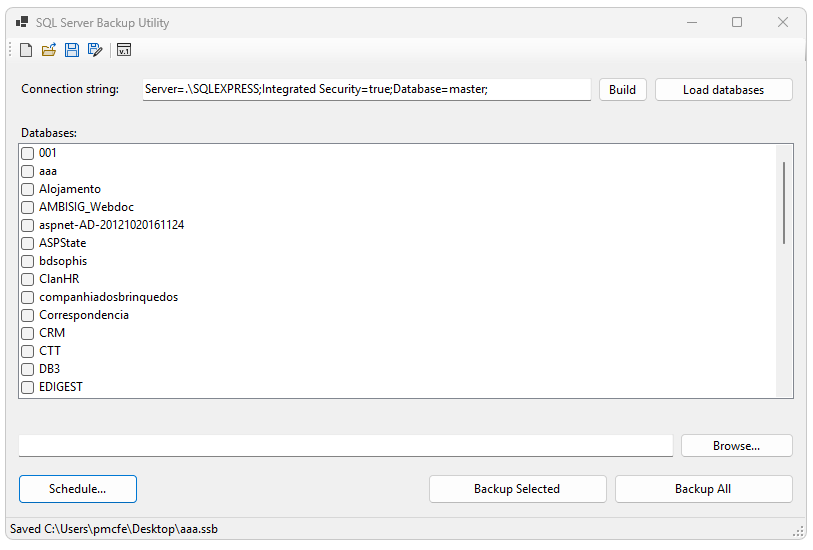

# SQL Server Backup Utility

A small Windows Forms utility to perform scheduled or on-demand backups of SQL Server databases. Supports a GUI for interactive use and a command-line mode for headless scheduled execution.

## Summary

This project is a .NET Windows Forms app (target: .NET 8.0 for Windows) that connects to a SQL Server instance, lists databases, and performs full or differential backups to a chosen folder. It also supports saving/loading which contains connection settings, selected databases, backup folder, and a schedule configuration. A scheduled Windows Task can be created/updated from the UI.

## Screenshot



Figure: Main application window

## Key features

- GUI to build/enter connection string, browse databases, and start backups interactively.
- Command-line mode to run the scheduler non-interactively.
- Differential vs full backup decision based on existing backups in the destination folder.
- Simple encrypted state file for storing configuration and schedules.
- Creates/updates Windows Scheduled Tasks for automated runs.

## Requirements

- Windows (desktop) — the app is a WinForms application.
- .NET 8.0 or newer runtime that supports `net8.0-windows`.
- Access to the target SQL Server instance and permissions to perform BACKUP DATABASE.
- The application uses `Microsoft.Data.SqlClient` (package referenced in the project).

## Build

Open the solution in Visual Studio (2022/2023 or newer) or build from the command line with the .NET SDK installed:

```powershell
dotnet build SQLServerBackupUtility.sln -c Release
```

The project file (`SQLServerBackupUtility/SQLServerBackupUtility.csproj`) targets `net8.0-windows` and references `Microsoft.Data.SqlClient`.

## Run

Interactive GUI:

1. Run the built executable (`bin\Debug\net8.0-windows\SQLServerBackupUtility.exe`) or start from Visual Studio.
2. Enter or build a connection string (Server/Data Source required). The app will append `TrustServerCertificate=True` if absent to avoid TLS certificate issues when connecting.
3. Click "Load databases" to enumerate databases (system DBs filtered out).
4. Choose a backup folder and select databases (or use "Backup All").
5. Click the backup button; progress and messages are shown in a log window.

Headless / Scheduler mode (command-line):

The app supports a non-interactive scheduler run:

```powershell
SQLServerBackupUtility.exe --run-scheduler [path-to-appstate|.ssb]
```

If no state file is provided it will look for `appstate.ssb` in the working folder. The process exits with a status code reflecting success/failure.

## State file and config

- The application saves state to a JSON structure which may be encrypted using `CryptoHelper`. Files produced by the UI are typically saved with extension `.ssb`.
- State contains: ConnectionString, BackupFolder, SelectedDatabases, and Schedule details.

## Backup behavior

- Backup files are written to the configured folder and named like `{DatabaseName}_yyyyMMdd.bak`.
- If a backup for the same database exists in the same month, the app will perform a differential backup; otherwise it will create a new full backup.

## Important files

- `Program.cs` — app entry point and CLI scheduler invocation.
- `Forms/MainForm.cs` — main UI and backup orchestration.
- `Helpers/BackupHelper.cs` — determines backup target file and whether to use differential backups.
- `Helpers/SchedulerRunner.cs`, `SchedulerTaskManager.cs` — schedule execution and Windows Task integration (create/update).

## Security & permissions

- The app may append `TrustServerCertificate=True` to the connection string to simplify TLS issues; for production use, ensure proper certificate configuration.
- The Windows account running the app (or the scheduled task) must have write permission to the backup folder and SQL Server credentials must have `BACKUP DATABASE` permissions.

## Notes & troubleshooting

- If `Load databases` fails, verify the connection string and network/firewall settings, and ensure the SQL Server accepts the chosen authentication method.
- For large databases, backups may take a long time; the app sets command timeout to unlimited for backup commands.
- The app uses a simple heuristic to choose differential backups (any backup in the same month -> differential). Adjust/inspect `Helpers/BackupHelper.cs` if you need a different policy.
